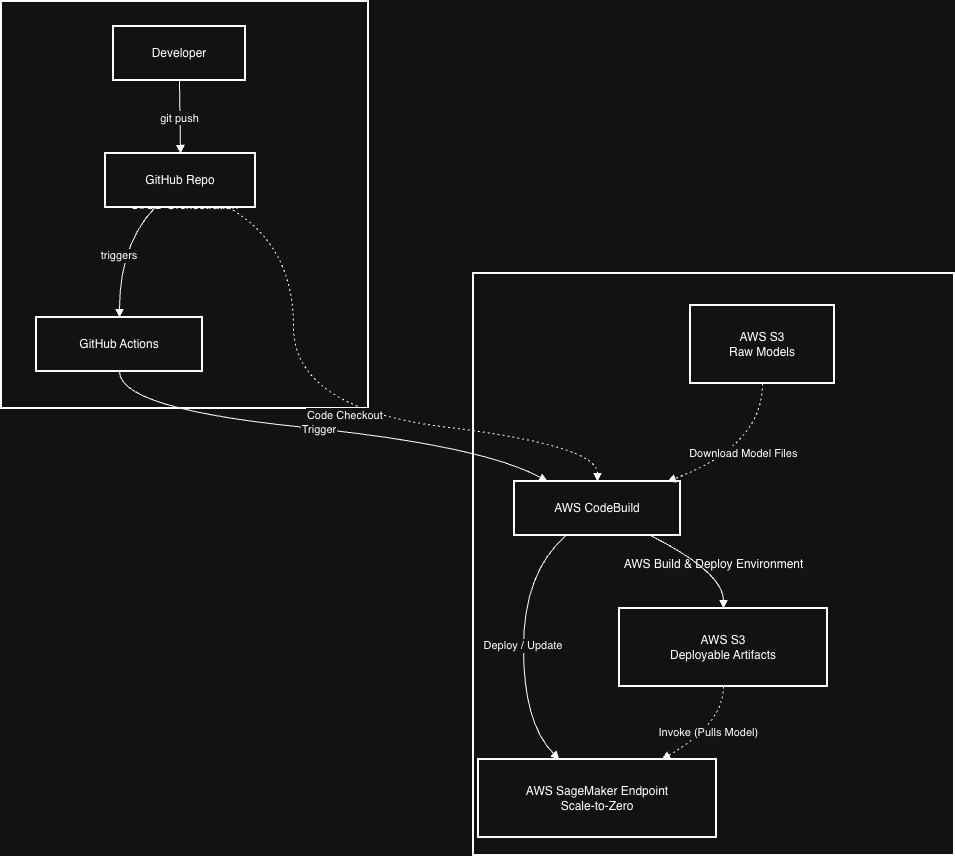

# End-to-End MLOps: Deploying a Large Language Model on AWS SageMaker with Scale-to-Zero

This project demonstrates a complete, production-grade MLOps pipeline for deploying a large language model for various downstream tasks on AWS SageMaker. The entire workflow is automated, repeatable, and cost-optimized, featuring a CI/CD pipeline that builds the model artifact and deploys it to a serverless endpoint that can scale down to zero.

Problems involving managing large model artifacts, ensuring reproducible deployments, and minimizing cloud infrastructure costs are successfully tackled in this repository.

Caveats:
- I make use of the Huggingface library as the wrapper for all models of interest. In case you require further optimization than HuggingFace and BitsandBytes this may not fit your requirements.

## Key Features

1. **Automated CI/CD Pipeline:** Every git push to the main branch automatically triggers a robust build and deployment process using GitHub Actions and AWS CodeBuild.
2. **Infrastructure as Code (IaC):** The entire AWS SageMaker infrastructure (Model, Endpoint Configuration, Endpoint) is defined and managed programmatically using a Python script with the Boto3 SDK, ensuring consistency and repeatability.
3. **Decoupled Artifact Management:** Large model files (>12 GB) are correctly stored in Amazon S3, while the lightweight inference code is version-controlled in Git. The CI/CD pipeline intelligently assembles these components into a final deployable artifact.
4. **Cost-Optimized Inference:** The SageMaker endpoint is configured using Inference Components with a minimum instance count of zero. This allows the endpoint to scale down completely when not in use, eliminating idle costs—ideal for applications with intermittent traffic.
5. **Cloud-Native & Scalable Architecture:** The solution overcomes the disk space limitations of standard CI runners by delegating the heavy-lifting (packaging large artifacts) to AWS CodeBuild, a scalable and powerful cloud-native build service.

## Architecture Diagram

## Tech Stack
- **Cloud Provider:** AWS
- **ML Service:** Amazon SageMaker (Inference Components)
- **CI/CD:** GitHub Actions (Orchestration), AWS CodeBuild (Build & Deploy)
- **Storage:** Amazon S3
- **Infrastructure as Code:** Python (Boto3 SDK)
- **ML Framework:** PyTorch, Hugging Face Transformers
- **Model:** Gemma-3-12B (or your chosen model)

## CI/CD Workflow Explained

1. **Code Commit:** The developer pushes changes to the inference.py script or the deploy.py script to the main branch of the GitHub repository.
2. **CI Trigger:** A GitHub Actions workflow is automatically triggered by the push. This workflow's primary role is to authenticate with AWS and start a build job on AWS CodeBuild.
3. **Build & Package (AWS CodeBuild):** This is where the heavy lifting occurs. The buildspec.yml file instructs CodeBuild to:
    + Download the large, static model files from a "raw-models" S3 bucket.
    + Download the inference code from the GitHub repo.
    + Package them together into the model.tar.gz structure required by SageMaker.
    + Upload this final artifact to a "deployable-artifacts" S3 bucket.
4. **Deploy (AWS CodeBuild):** In the post_build phase, CodeBuild executes the deploy.py script. This script uses the Boto3 SDK to:
    + Create a new SageMaker Model object pointing to the new model.tar.gz artifact.
    + Create a SageMaker Endpoint Configuration with the scale-to-zero settings.
    + Create or update the SageMaker Endpoint to use the new configuration, completing the deployment.

## Project Setup

To replicate this project, follow these steps:

1. **Prerequisites:**
    - An AWS Account with appropriate IAM permissions.
    - A GitHub repository.
    - Python 3.8+ and boto3 installed locally.
    - AWS CLI configured on your local machine.

2. **Model Setup:**
    - Download the LLM you wish to deploy.
    - Manually upload the model files to an S3 bucket. Let's call this your "raw models" bucket (e.g., s3://my-bucket/raw-models/gemma-12b/).

3. **IAM Roles:**
    - Create a SageMaker Execution Role with permissions to access S3 and CloudWatch Logs.
    - Create an AWS CodeBuild Service Role with permissions to pull from S3, push to S3, and perform SageMaker actions (AmazonSageMakerFullAccess).

4. **Configure AWS CodeBuild:**
    - In the AWS Console, create a new CodeBuild project.
    - Connect it to your GitHub repository using the AWS Connector for GitHub.
    - Configure the environment to use a standard Ubuntu image.
    - In the environment variables section, add SAGEMAKER_ROLE_ARN and provide the ARN of the SageMaker role you created.

## How to Use the Deployed Endpoint
